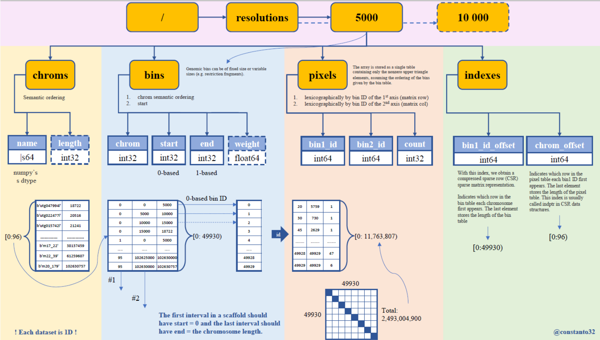

Инструкция по визуализации карт Hi-C контактов в форамате .cool

## Higlass

Higlass является геномным браузером для карт контаков Hi-C, также позволяющим визуализировать одномерные геномные треки. Higlass является клиент-серверным приложением. Визуализация карт Hi-C осуществляется с помощью разбиения матрицы на отдельные тайлы на бэкенде и их подгрузки в web интерфейс.

[higlass.io](http://higlass.io/) - web приложение для визуализации публичных предзагруженных данных.

Сервис содержит предзагруженные данные крупных исследований, в которых составлялись карты контактов Hi-C, присутствуют большинство модельных геномов, снабженные дополнительными треками: аннотации генов, гистонных модификаций, метилирования и т.д.

Для визуализации ваших собственных данных Higlass может быть установлен локально или на удаленном сервере с помощью Docker. 

[Инструкция по установке](https://docs.higlass.io/tutorial.html).

## Cooler API (Задание)

Если стоит задача, не просто посмотреть на карту контактов, но и получить непосредственный доступ к данным, содержащимся в .cool, мы можем использовать API библиотеки самого cooler.

В [репозитории cooler](https://github.com/open2c/cooler-binder) находятся jupyter ноутбуки с подробным описанием как работать с CLI версией cooler и как работать с API библиотеки Cooler.

API cooler предназначен непосредственно для доступа к данным внутри .cool контейнера, который по сути является контейнером .hdf5.

Схема датасетов внутри .cool файла представлена на рисунке:

<p align="center">
  
</p>

Вам предлагается выполнить два задания с использованием Cooler API

## I визуализация матрицы контактов генома человека, полученной на первой практике.

Необходимо иметь окружение, содержащее cooler. 

Вы можете использовать Conda env из первой практики или установить с нуля:

```{bash}
python3 -m venv cooler_venv
source ./cooler_venv/bin/activate
pip install cooler
```

## II - посчитать статистику для второго инварианта

На втором практическом занятии мы рассматривали статью [Three invariant Hi-C interaction patterns: Applications to genome assembly](https://www.sciencedirect.com/science/article/abs/pii/S1046202317302414)

В статье раскрыты методы подсчета характерных метрик матрицы контактов Hi-C.

Краткое содержание и формулы подсчета метрик приведены в [pdf файле](./invariant_patterns.pdf).

В качестве примера приводится [jupyter notebook](./invariant_I.ipynb) с подсчетом первого инварианта на реальной карте Hi-C для комара вида Anopheles Gambiae.

Ваша задача повторить анализ для второго инварианта.

В качестве отчета по второй практической работе необходимо прислать jupyter notebook с двумя вывполненными заданиями.
